# PetLife v9 Enterprise - ER Model

依據 `petlife_db.sql` 產生，共整理出 **15 張資料表**、**14 組外鍵關聯**。

```mermaid
erDiagram
    users {
        INT id "PK"
        VARCHAR_50 name
        VARCHAR_100 email "UK"
        VARCHAR_30 phone
        VARCHAR_128 password_hash
        VARCHAR_30 role
        TIMESTAMP created_at
    }
    pets {
        INT id "PK"
        VARCHAR_50 name
        VARCHAR_20 species
        VARCHAR_60 breed
        VARCHAR_10 gender
        INT age
        DOUBLE weight
        VARCHAR_30 chip_number
        TEXT health_note
        TIMESTAMP created_at
    }
    health_records {
        INT id "PK"
        INT pet_id "FK"
        VARCHAR_20 record_date
        DOUBLE weight
        VARCHAR_20 appetite
        VARCHAR_20 stool_status
        VARCHAR_100 symptom
        TEXT note
        TIMESTAMP created_at
    }
    service_bookings {
        INT id "PK"
        INT pet_id "FK"
        VARCHAR_30 service_type
        VARCHAR_80 provider_name
        VARCHAR_20 booking_date
        VARCHAR_20 status
        TEXT note
        TIMESTAMP created_at
    }
    lost_reports {
        INT id "PK"
        INT pet_id "FK"
        VARCHAR_20 lost_date
        VARCHAR_120 lost_location
        VARCHAR_30 contact_phone
        VARCHAR_20 status
        TEXT description
        TIMESTAMP created_at
    }
    pet_places {
        INT id "PK"
        VARCHAR_30 place_type
        VARCHAR_100 name
        VARCHAR_160 address
        VARCHAR_30 phone
        TEXT note
        TIMESTAMP created_at
    }
    care_reminders {
        INT id "PK"
        INT pet_id "FK"
        VARCHAR_30 reminder_type
        VARCHAR_20 reminder_date
        VARCHAR_100 title
        VARCHAR_20 status
        TEXT note
        TIMESTAMP created_at
    }
    vaccination_records {
        INT id "PK"
        INT pet_id "FK"
        VARCHAR_80 vaccine_name
        VARCHAR_100 hospital
        VARCHAR_20 vaccination_date
        VARCHAR_20 next_date
        VARCHAR_20 status
        TEXT note
        TIMESTAMP created_at
    }
    medical_records {
        INT id "PK"
        INT pet_id "FK"
        VARCHAR_100 hospital
        VARCHAR_60 doctor
        VARCHAR_20 visit_date
        TEXT symptom
        TEXT diagnosis
        TEXT medicine
        DOUBLE cost
        TIMESTAMP created_at
    }
    pet_photos {
        INT id "PK"
        INT pet_id "FK"
        VARCHAR_255 photo_path
        VARCHAR_120 caption
        TIMESTAMP created_at
    }
    notifications {
        INT id "PK"
        INT user_id "FK"
        VARCHAR_120 title
        TEXT content
        TINYINT is_read
        TIMESTAMP created_at
    }
    favorites {
        INT id "PK"
        INT user_id "FK"
        INT place_id "FK"
        TIMESTAMP created_at
    }
    reviews {
        INT id "PK"
        INT user_id "FK"
        INT place_id "FK"
        INT booking_id "FK"
        INT rating
        TEXT comment
        TIMESTAMP created_at
    }
    community_posts {
        INT id "PK"
        INT user_id "FK"
        VARCHAR_120 title
        TEXT content
        VARCHAR_30 category
        TIMESTAMP created_at
    }
    adoptions {
        INT id "PK"
        VARCHAR_60 pet_name
        VARCHAR_20 species
        VARCHAR_60 breed
        VARCHAR_100 shelter_name
        VARCHAR_30 contact_phone
        VARCHAR_20 status
        TEXT note
        TIMESTAMP created_at
    }
    pets ||--o{ health_records : "id to pet_id"
    pets ||--o{ service_bookings : "id to pet_id"
    pets ||--o{ lost_reports : "id to pet_id"
    pets ||--o{ care_reminders : "id to pet_id"
    pets ||--o{ vaccination_records : "id to pet_id"
    pets ||--o{ medical_records : "id to pet_id"
    pets ||--o{ pet_photos : "id to pet_id"
    users ||--o{ notifications : "id to user_id"
    users ||--o{ favorites : "id to user_id"
    pet_places ||--o{ favorites : "id to place_id"
    users ||--o{ reviews : "id to user_id"
    pet_places ||--o{ reviews : "id to place_id"
    service_bookings ||--o{ reviews : "id to booking_id"
    users ||--o{ community_posts : "id to user_id"
```

## 關聯摘要

- `pets.id` 1 對多 `health_records.pet_id`（ON DELETE CASCADE）
- `pets.id` 1 對多 `service_bookings.pet_id`（ON DELETE CASCADE）
- `pets.id` 1 對多 `lost_reports.pet_id`（ON DELETE CASCADE）
- `pets.id` 1 對多 `care_reminders.pet_id`（ON DELETE CASCADE）
- `pets.id` 1 對多 `vaccination_records.pet_id`（ON DELETE CASCADE）
- `pets.id` 1 對多 `medical_records.pet_id`（ON DELETE CASCADE）
- `pets.id` 1 對多 `pet_photos.pet_id`（ON DELETE CASCADE）
- `users.id` 1 對多 `notifications.user_id`（ON DELETE SET NULL）
- `users.id` 1 對多 `favorites.user_id`（ON DELETE CASCADE）
- `pet_places.id` 1 對多 `favorites.place_id`（ON DELETE CASCADE）
- `users.id` 1 對多 `reviews.user_id`（ON DELETE SET NULL）
- `pet_places.id` 1 對多 `reviews.place_id`（ON DELETE SET NULL）
- `service_bookings.id` 1 對多 `reviews.booking_id`（ON DELETE SET NULL）
- `users.id` 1 對多 `community_posts.user_id`（ON DELETE SET NULL）

## 補充說明

- `favorites` 是使用者與寵物地點收藏的中介表。
- `reviews` 可連結使用者、地點與服務預約。
- `pets` 目前在 SQL 中沒有 `user_id` 外鍵，因此 ER 圖依照檔案內容呈現為獨立主表。